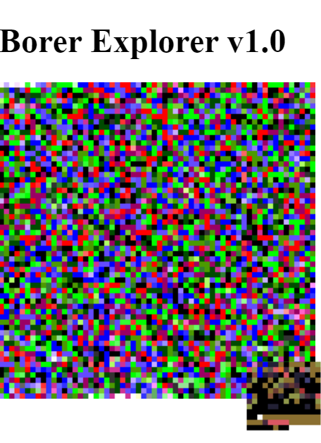

# Borer Explorer 1D v1.0.6.1
Borer Explorer is an example of sequenced programming using functions and sequences to read and alter data including images. This is my starting guide which explains working on 1D arrays to achieve 2D results.
See http//turtledna.neocities.org for a working demo.

A small program called a borer runs on an image, and each number in an initial sequence relates to a function in something called the codex. The codex is a small library of functions. The borer moves around the image and performs tasks, which too can be installed into the codex. 

The complexity of the sequence and the image matter, and give different results. This is a starting example of the power of sequenced programming.

When the borer runs out of steam it stops, and requires more input to continue ( I will put this in a future example ).

# Color palette extractor tool
There is a useful color palette extractor made using a single function in the codex which samples the current pixel or block and weighs the colors according to age or interactions. This is my first use of borer to build a program for image processing. See http://turtledna.neocities.org/imagetocolorpalette 

# To run
Download and extract first, then run index.html on Apache server or http://localhost. Built using Chrome.
